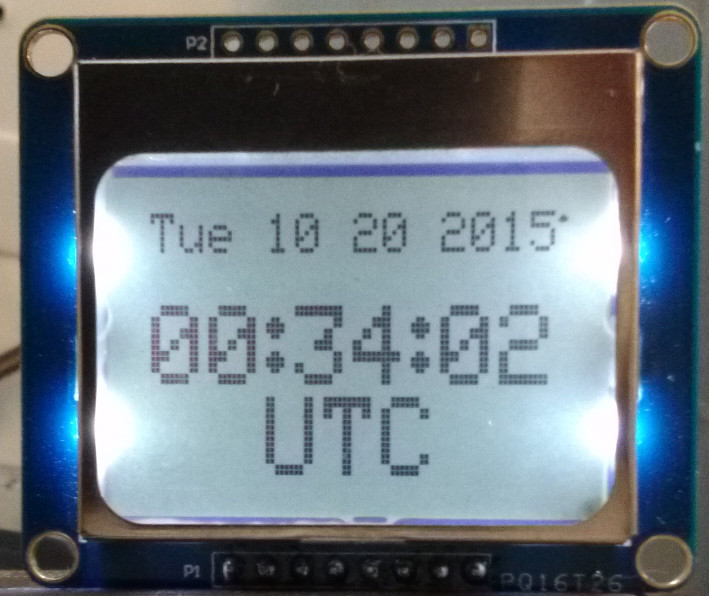

# esp-pcd-ntp
ESP8266 Arduino WiFi clock for PCD8544 LCD display periodically synchronized with
Network Time Protocol servers.

This program requests date and time from time.nist.gov which randomly selects
from a pool of NTP (Network Time Protocol) servers.

## Hardware Parts ##

This project uses the same hardware connected in the same way as the
[esp-pcd-weather](http://x10linux.blogspot.com/2015/09/display-weather-on-small-lcd-using.html) project.

* [Adafruit Huzzah ESP8266](https://www.adafruit.com/products/2471)
* [Adafruit PCD8544/5110 display](https://www.adafruit.com/product/338)
* [Adafruit USB to TTL serial cable](https://www.adafruit.com/products/954)

## Connections ##

USB TTL    |Huzzah ESP8266|PCD8544/Nokia 5110 |Description
-----------|-----------|-----------|-------------------------------------------------------------
           |GND        |GND        |Ground
           |3V         |VCC        |3.3V from Huzzah to display
           |14         |CLK        |Output from ESP SPI clock
           |13         |DIN        |Output from ESP SPI MOSI to display data input
           |12         |D/C        |Output from display data/command to ESP
           |#5         |CS         |Output from ESP to chip select/enable display
           |#4         |RST        |Output from ESP to reset display
           |15         |LED        |3.3V to turn backlight on, GND off
GND (blk)  |GND        |           |Ground
5V  (red)  |V+         |           |5V power from PC or charger
TX  (green)|RX         |           |Serial data from IDE to ESP
RX  (white)|TX         |           |Serial data to ESP from IDE

## Dependencies ##

* [Fork of Adafruit PCD8544 library with changes for ESP8266]
  (https://github.com/bbx10/Adafruit-PCD8544-Nokia-5110-LCD-library/tree/esp8266).
  Use the esp8266 branch!
* Adafruit GFX library. Use the Arduino IDE Library Manager to get the latest version.
  No changes are needed for the ESP8266.
* The [Time](https://github.com/PaulStoffregen/Time) library provides date and
  time with synchronization with external date and time sources. The library
  requests date and time from a Network Time Protocol (NTP) server every 5
  minutes. In between calls to the NTP server, the library uses the millis()
  function to update the date and time. The NTP part of this program is based
  on the Time_NTP example.
